Milestone Project 3
======

## **CookBook | Yummy Recepies For Everyone** ##
By: [Marina Christen](mailto:puksbusinessworld@gmail.com), August 2021<br>
This webpage is the third of four Milestone Projects which is a part of the Full Stack Web Development Program of [Code Institute](https://www.codeinstitute.net/).


Live Project
======

[View the live project here](https://msp3-cookbook.herokuapp.com/)


Screenshot
======

All screenshots created using [Am I responsive](http://ami.responsivedesign.is/).

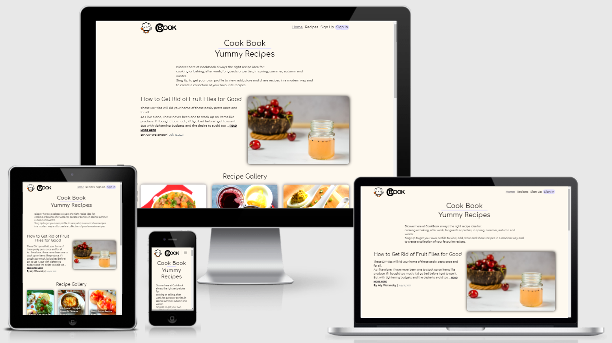

---
# Table of contents

+ [Project](#project)
  * [Project Description](#project-description)  
  * [Project Goals](#project-goals)
  * [Website Description](#website-description)
  * [Website Owner's Goals](#website-owners-goals)

+ [User Experience (UX)](#user-experience-ux)  
  * [User Stories](#user-stories)    

+ [Design](#design)
  * [Colours](#colours)
  * [Typography](#typography)    
  * [Imagery](#imagery)
  * [Responsive Front-end Design](#responsive-front-end-design)
  * [Back-end Design](#back-end-design)
  * [Topology](#topology)  
  * [Wireframes](#wireframes)
  * [Database](#database-design)

+ [Technologies](#technologies)
  * [Languages](#languages)
  * [Database](#database)
  * [Libraries](#libraries)
  * [Tools](#tools)

+ [Features](#features)
  * [Page Features and Layout](#page-features-and-layout)
    - [Responsive Navbar](#responsive-navbar)
    - [Footer](#footer)
    - [Home Page](#home-page)
    - [Article Page](#article-page)
    - [Recipes Page](#recipes-page)
    - [Recipe Page](#recipe-page)    
    - [User Sign Up Page](#user-sign-up-page)
    - [User Sign In Page](#user-sign-in-page)
    - [Profile Page](#profile-page)
    - [Add Recipe Page](#add-recipe-page)
    - [Edit Recipe Page](#edit-recipe-page)
    - [Information Pages](#information-pages)
  * [Products](#products)
  * [User Alerts](#user-alerts)
  * [Additional Site features](#additional-site-features)
  * [Future Features](#future-features)

+ [Testing](#testing)      

+ [Bugs](#bugs)

+ [Deployment](#deployment)
  * [Cloning the-reading-room from GitHub](#cloning-the-reading-room-from-github)
    - [Prerequisites](#prerequisites)
    - [Cloning the GitHub repository](#cloning-the-github-repository)
    - [Creation of a Python Virtual Environment](#creation-of-a-python-virtual-environment)
    - [Install the App dependencies and external libraries](#install-the-app-dependencies-and-external-libraries)
    - [Create the database in MongoDB](#create-the-database-in-mongodb)
    - [Create `env.py` file](#create-env.py-file)
    - [Run the application](#run-the-application)
  * [Deploying The Reading Room app to Heroku](#deploying-the-reading-room-app-to-heroku)
    - [Create the Heroku App](#create-the-heroku-app)
    - [Push your repository to GitHub](#push-your-repository-to-github)
    - [Connect Heroku to GitHub](#connect-heroku-to-github)
    - [Launch the App](#launch-the-app)

+ [Credits](#credits)
  * [Images](#images)
  * [Content](#content) 
  * [Code](#code)   
  * [Acknowledgements](#acknowledgements)  
  

<small><i><a href='http://ecotrust-canada.github.io/markdown-toc/'>Table of contents generated with markdown-toc</a></i></small>

---


Project
======

### **Project Description** ###
This is a Python and Data Centric based Project.<br>
The purpose of this project is to showcase the knowledge of HTML, CSS, JavaScript, Python+Flask, MongoDB and Heroku I gained so far in this course and give users the possibility to Create, Read, Update, and Delete their own content and data (CRUD) on and with this web application.

Project Requirements:<br>
HTML, CSS, JavaScript, Python+Flask, MongoDB, Heroku

### **Project Goals** ###
- To build something awesome to be proud of
- To make effective use of course knowledge and fulfill all given requirements
- To make a project with a great looking layout, that works and that is practical
- To create a web application that makes the user want to stay and use with pleasure

- To use the CRUD features for this app to interaction with the MongoDB database management system.

**Create** - or upload a data into the database which can then be viewed by all other registered users.

**Read** - or view all the data on the web application, which is stored in the database.
The data can be filtered by keywords of the users choice.

**Update,** - change or add additional information of their own data stored in the database within the limits of the input form.

**Delete** - their own data stored in the database. This functionality is NOT extended to other user's data.
The website has been designed with a basic level of security
In order to prevent unwanted editing or deleting data of other user's data.

### **Website Description** ###
CookBook is a (fictitious) easy to use and interactive designed website to provide user's with a choice of recipes. 

Some of the features to guarantee a easy use and good review are a search functionality and a limited number of recipe per page with a pagination at the bottom of the page to rids the need to endless scrolling.<br> 
All users have access to articles, social media contacts, conditions, general terms and other contact informations and they can subscribe to a newsletter. 

Registered users have a account with a profile page with a list of all marked favourite recipes, a list of all added recipes and the possibility to change the password.  They can share, edit and delete recipes.

Please note: This is only to simulate an affiliate marketing business model for educational purposes and in no way endorses or implies a business relationship with the chosen retailers.

### **Website Owner's Goals** ###
- To build awareness of the brand
- To promote a brand of cooking tools
- To increase traffic to the site and in turn increase registration
- To provide simple easy sign up process to enable users to register
- To provide easy and simple to understandable information on recipes
- To be visually striking to catch attention and provoke curiosity to explore the page
- To encourage advertisers to place their ads on the page for untensils and other cooking items 
- To opening up more opportunities for more recipes, engagement, special offers and expansion of the site
- To get users to be able to engage by uploading their own thus making it a creative and user driven platform

[Back to Table of contents](#table-of-contents)


User Experience (UX)
======

### **User Stories** ###
"As a user, I want:"
- to view the site on different devices (mobile, tablet, desktop)
- to know the sites purpose immediately
- to be able to navigate the site easily
- to be able to find any information they have and need to provide
- to view recipes without needing to sign up
- to search and find recipes intuitive with keywords
- to see benefits to signing up for such a site
- to have an easy sign up process
- to be able to sign in and sign out of my own profile
- to create my own profile
- to change my password
- to add my favourite recipes to a list on my own profile site
- to have an easily explained way to add and share recipes on the website
- to edit my recipes
- to delete my recipes
- to see a list of my own recipes on my own profile site

[Back to Table of contents](#table-of-contents)


Design
======

### **Colours** ###
I find inspiration for colour schemes on [Coolors](https://coolors.co/).
The website has a simple light color scheme, with some darker colours to set contrasts. This gives some separation without overpowering the layout in combination with the colorful pictures of the recipes.


​

BODY & NAVBAR
- *Floral White* (#FEF9EF)

FOOTER
- *Lavender Web* (#E3DFFF)

TEXT
- *Smoky Black* (#0F0A0A)
- *Dim Gray* (#6D6A75)
- *Lavender Web* (#E3DFFF)

BUTTON
- *Ruby Red* (#9A031E)
- *Dim Gray* (#6D6A75)
- *Lavender Web* (#E3DFFF)

SHADOW
- *Dim Gray* (#6D6A75)

COLOUR ACCENTS
- *Ruby Red* (#9A031E)
- *Dim Gray* (#6D6A75)
- *Lavender Web* (#E3DFFF)
- *Floral White* (#FEF9EF)

### **Typography** ###
I've chosen fonts that complement eachother using a combination of serif and sans-serif fonts.

The chosed fonts are [Comfortaa](https://fonts.google.com/specimen/Comfortaa?standard-styles=&query=Comfortaa) for the headings and [Montserrat](https://fonts.google.com/specimen/Montserrat?standard-styles=&query=mon) for the body text.

The font for the content Logo was created using [Arial Rounded MT Bold](https://docs.microsoft.com/sv-se/typography/font-list/arial-rounded-mt) to give it a rounded harmonic look.

### **Imagery** ###

<br>

A simple and good recognisable Icon and Logo/Brand, designed and created by the developer with [paint.net](https://www.getpaint.net/roadmap.html).

### **Responsive Front-end Design** ###
Responsive mobile first design using the Bootstrap framework.
Jinja2 templating framework for Python is used to create the site's front-end dynamic content.

### **Back-end Design** ###
The app is created using Python3 and a Flask framework to render the HTML pages.
The site is deployed via a Heroku app linked to a GitHub repository.
The dynamic content is served utilising a MongoDB document based database.

### **Topology** ###
- Public


- Registerd Users


- Admin


- Footer


### **Wireframes** ###
I designed the site mock-ups using [paint.net](https://www.getpaint.net/roadmap.html).

Public Page
- [Home Page](Documentation/wireframes/home-page.png)
- [Article Page](Documentation/wireframes/article-page.png)
- [Recipes Page](Documentation/wireframes/recipesPublic-page.png)
- [Search Result](Documentation/wireframes/searchRecipe.png)
- [Recipe Page](Documentation/wireframes/recipePublic-page.png)
- [Sign Up](Documentation/wireframes/signUp-page.png)
- [Sign In](Documentation/wireframes/signIn-page.png)
- [Template Page](Documentation/wireframes/template-page.png)
  - Contact, About Us, Advertise, Accessibility, Terms Of Use, Privacy Policy 

For registered Users
- [Profile Page](Documentation/wireframes/profileUser-page.png)
- [Recipes Page](Documentation/wireframes/recipesUser-page.png)
- [Recipe Page](Documentation/wireframes/recipeUser-page.png)
- [Add Recipe](Documentation/wireframes/addRecipe-page.png)
- [Edit Recipe](Documentation/wireframes/editRecipe-page.png)

For Admin
- [Profile Page](Documentation/wireframes/profileAdmin-page.png)
- [Recipes Page](Documentation/wireframes/recipesAdmin-page.png)
- [Recipe Page](Documentation/wireframes/recipeAdmin-page.png)
- [Add Recipe](Documentation/wireframes/addRecipe-page.png)
- [Edit Recipe](Documentation/wireframes/editRecipeAdmin-page.png)

### **Database** ###
Designe

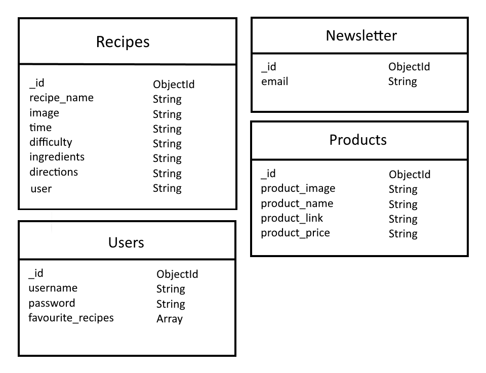

Structure
- [user collection](Documentation/database/user.json)
- [recipes collection](Documentation/database/recipes.json)
- [newsletter collection](Documentation/database/newsletter.json)
- [products collection](Documentation/database/products.json)

[Back to Table of contents](#table-of-contents)


Technologies
======

### **Languages** ###
- [HTML5](https://developer.mozilla.org/en-US/docs/Web/HTML)
  - Used as the main markup language for the website content.
- [CSS3](https://developer.mozilla.org/en-US/docs/Web/CSS)
  - Used to style the individual webpages.
- [JavaScript](https://developer.mozilla.org/en-US/docs/Web/JavaScript)
  - Used to create the interactive functionality of the website
- [Python3](https://www.python.org/)
  - Used to create the main application functionality

### **Database** ###
- [MongoDB Atlas](https://www.mongodb.com/)
  - Cloud based document-oriented database used to store the backend data.

### **Libraries** ###
- [Bootstraps](https://getbootstrap.com/)
  - Used to design a mobile-first responsive website layout.
- [Flask](https://www.fullstackpython.com/flask.html)
  - Python web framework
- [Werkzeug](https://werkzeug.palletsprojects.com/en/1.0.x/)
  - A comprehensive WSGI web application library installed with Flask
- [PyMongo](https://pymongo.readthedocs.io/en/stable/)
  - PyMongo is a Python tool for working with MongoDB
- [Flask-Pymongo](https://flask-pymongo.readthedocs.io/en/latest/)
  - Flask-PyMongo bridges the gap between Flask and PyMongo
- [jQuery](https://jquery.com/)
  - Used for the initialisation of the Bootstrap CSS components functionality.
- [Jinja](https://jinja.palletsprojects.com/en/2.11.x/)
  - Templating language for Python.

### **Tools** ###
- [Git](https://git-scm.com/)
  - Git was used for version control by utilizing the Gitpod terminal to commit to Git and push to GitHub.
- [GitHub](https://github.com/)
  - Used to store, host and deploy the project files and source code after being pushed from Git.
- [Gitpod](https://www.gitpod.io/)
  - An online IDE linked to the GitHub repository used for the majority of the code development.
- [Heroku](https://heroku.com/)
  - Used to run and scale the web application.  
- [CodePen](https://codepen.io)
  - An online code editor and open-source learning environment used to test small sections of code quickly and easily.
- [Font-Awesome](https://fontawesome.com/icons?d=gallery)
  - Used for icons to enhance headings and add emphasis to text.
- [Google fonts](https://fonts.google.com/)
  - Used for the website fonts.
- [Coolors](https://coolors.co/)
  - An online tool used to choose the website colour scheme.
- [paint.net](https://www.getpaint.net/roadmap.html)
  - Used to create the Icon, Favicon and Logo/Brand of the webpage.
- [Inkscape](https://inkscape.org/)
  - Used to change .png and .jpg images into .svg (Scalable Vector Graphics).
- [Am I Responsive?](http://ami.responsivedesign.is/)
  - A tool for taking a quick snapshot of the responsive breakpoints of the website to visualize how the site will look on different device screen sizes in one place. The resulting screenshot is also used as the README.md logo image.
- [What is my Screen Resolution](http://whatismyscreenresolution.net/)
  - An online tool to find out the screen resolution on your device used for CSS @media queries
- [randomkeygen.com](https://randomkeygen.com/)
  - Random secure password & keygen generator used to create the Flask SECRET_KEY.

[Back to Table of contents](#table-of-contents)


Features
======

### **Page Features and Layout** ###
#### **Responsive Navbar** ####
Responsive Navbar sticks at the top of the web page and changes at smaller screen sizes.

The navbar contains:
- the site Icon with a on click link redirect the user back to the home page
- the site Logo/Brand with a on click link redirect the user back to the home page
- a menu Icon for the collapsable navbar for small screen sizes

*Screen Size min-width 768 px*
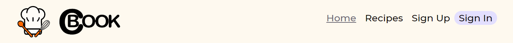
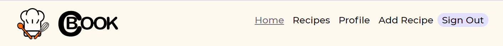

*Screen Size max-width 768 px*

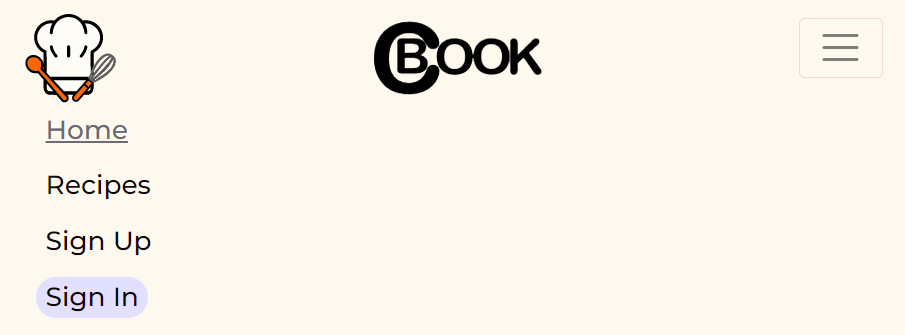
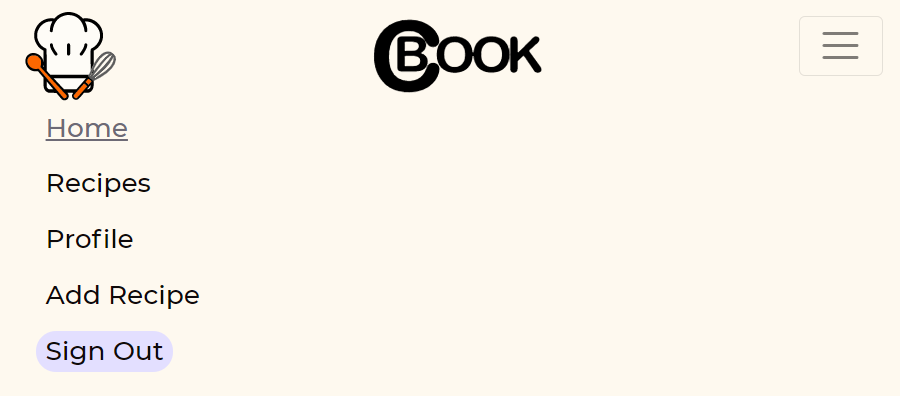

#### **Footer** ####
The footer contains:
- Social Media Icons with social media on click links direct the user to Facebook, Instagram, Youtube
- a field to subscribe with the email address to the newsletter
- the copyright information with a current year JavaScript function
- all law, contact and other informations for the web page with on click links direct the user to those pages
- Icon with on click link direct the user back to the top of the page

  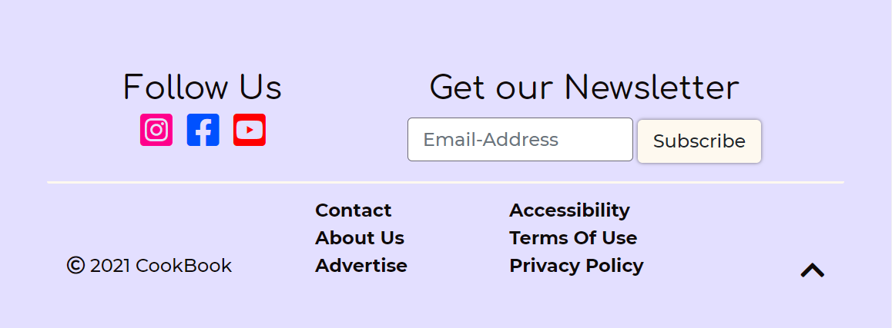

#### **Home Page** ####
The home page contains: 
- an intro text
- a short description to an article page with image and a on click link direct the user to the article page
- a gallery of six random recipe images with a on click link direct the user to the recipe page

  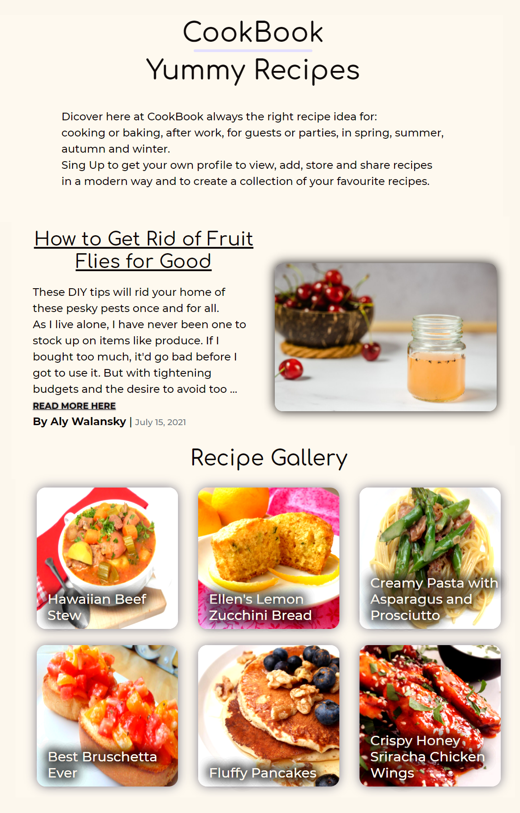

#### **Article Page** ####
The article page contains: 
- an interesting content with informations for a nice home
- images for a nice visual look
- in content on click links direct the user to the advertiser
- product card for advertisers with an on click link button direct the user to the original product site

  

#### **Recipes Page** ####
The recipes page contains:
- a search field to filter the recipes with keywords
- a reset button with an on click link redirect the user to the recipes page
- recipe cards with a image of the recipe, recipe information and with an on click link direct the user to the recipe page
- a pagination at the bottom of the page

  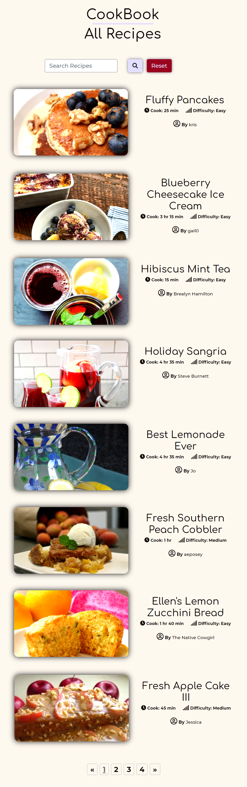
  
- a favourite button to add a recipe to the favourite list only available to logged in users 

  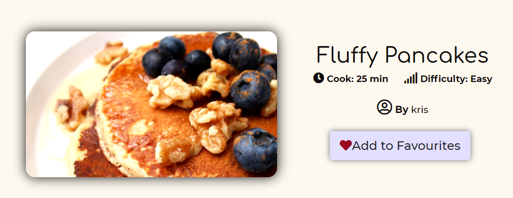

- a edit and delete button only available for the Admin

  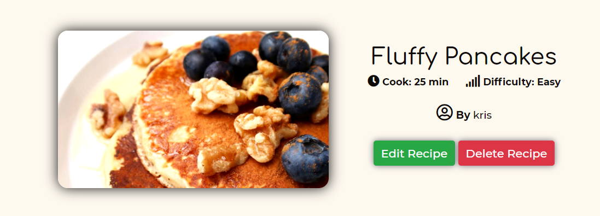

#### **Recipe Page** ####
The recipe page contains:
- a search field to filter the recipes with keywords
- a reset button with an on click link redirect the user to the recipes page
- recipe name
- a larg image of the recipe
- total time 
- difficulty
- recipe ingredients
- recipe directions
- created_by
- a button at the bottom of the page with an on click link redirect the user to the recipes page 

  

- a favourite button to add a recipe to the favourite list only available to logged in users 

  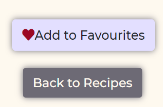

- a edit and delete button only available for the Admin

  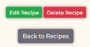

#### **User Sign Up Page** ####
- New users are encouraged to create a new account to access more site features.
- Usernames are required to be unique and are checked against existing usernames in the users collection
- The user is required to complete all fields and check-box before the new user is saved to the users collection
- There is an information under the form with an on click link redirect the user to the sing in page 
  
  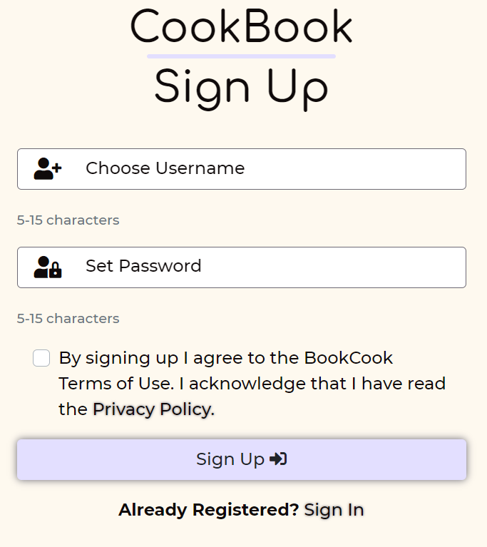

#### **User Sign In Page** ####
- The user name and password are validated against existing users in the users collection
- Users will not be allowed to sign in if either the username or password are incorrect
- There is an information under the form with an on click link redirect the user to the sing up page

  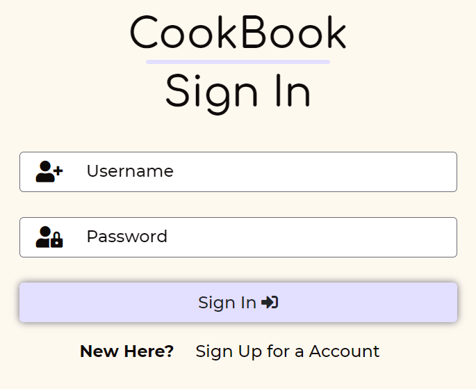

#### **Profile Page** ####
The Profile page contains: 
- a User Icon and a greeting with the users name
- some informations about the feature on the profile page
- a list with the summary of the user's favourites recipes with a remove button
- a list with the summary of the user's added recipes with an edit and delete button

  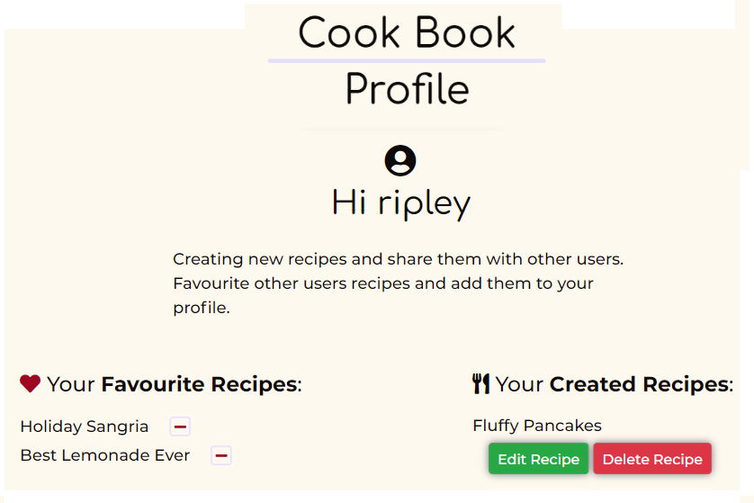 

  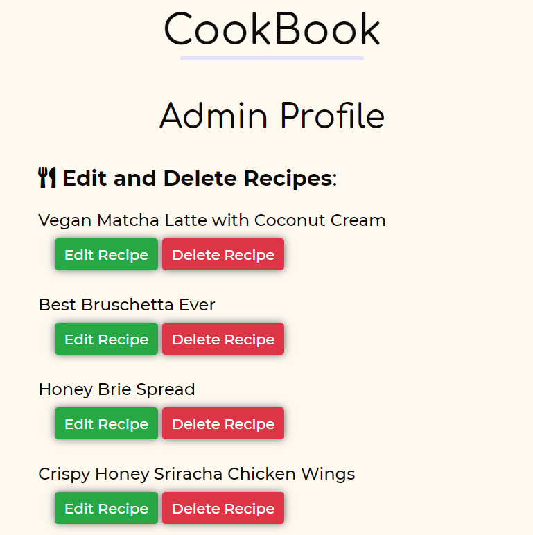

- a complete list with all the recipes of the web page with an edit and delete button under each recipe

  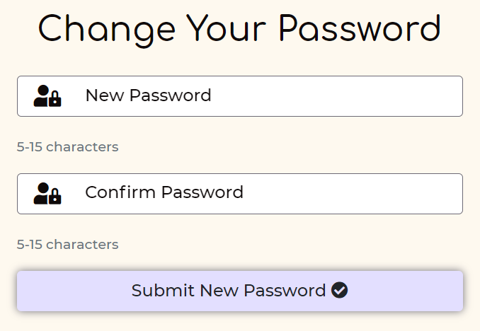

- a form to change the current password
- the user needs to confirm the new password to avoid any typ errors

#### **Add Recipe Page** ####
- Users who are sing in can create a recipe by entering the recipe details in the add recipe form  
- The Create Recipe button submits the form data to create a new document in the recipes database

  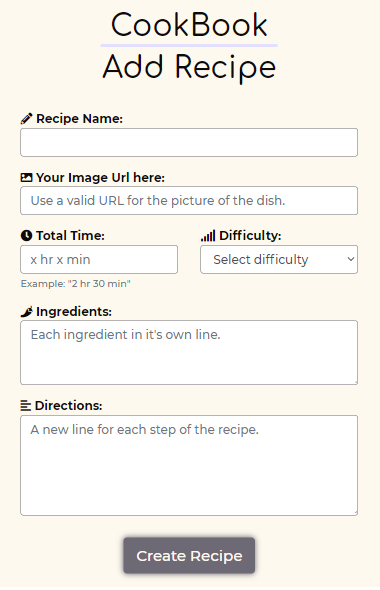

#### **Edit Recipe Page** ####
- Only users who created the recipe are permitted to edit the recipe
- Loading the page gets the current recipe data from the recipes collection and pre-fills the edit form
- The red cancel button returns the user to the profile page without making any changes
- The green edit button updates the recipe details with the new data from all the form input fields

  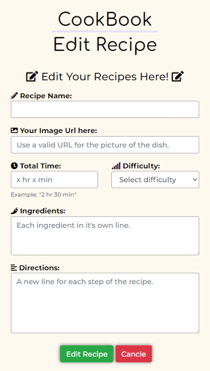

  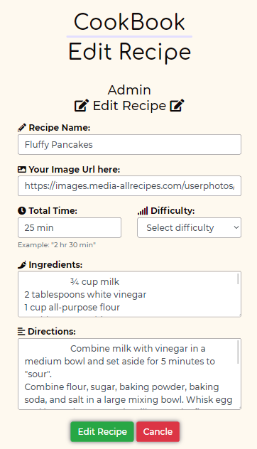

- The Admin has the permission to edit and delete all the recipe
- Loading the page gets the current recipe data from the recipes collection and pre-fills the edit form
- The red cancel button returns the Admin to the profile page without making any changes
- The green edit button updates the recipe details with the new data from all the form input fields

#### **Information Pages** ####
The following page contains: 
- information to the web page owners
- contact information to the web page owners with an click on link to the contact email address
- the purpose of this web page
- all terms and conditions informations

  [Contact Page](Documentation/layout/contactPage.png)

  [About Us Page](Documentation/layout/aboutUsPage.png)
  
  [Advertise Page](Documentation/layout/advertisePage.png)
  
  [Accessibility Page](Documentation/layout/accessibilityPage.png)
  
  [Terms Of Use Page](Documentation/layout/termsOfUsePage.png)
 
  [Privacy Policy Page](Documentation/layout/privacypolicyPage.png)
  
### **Products** ###
The Product section is at the bottom of the:
- Home Page
- Recipes Page
- Recipe Page
- Sing Up Page
- Sing In Page
- Profile Page

The Product section contains: 
- three cards with random products of the advertisers with an on click link direct the user to the original product site

  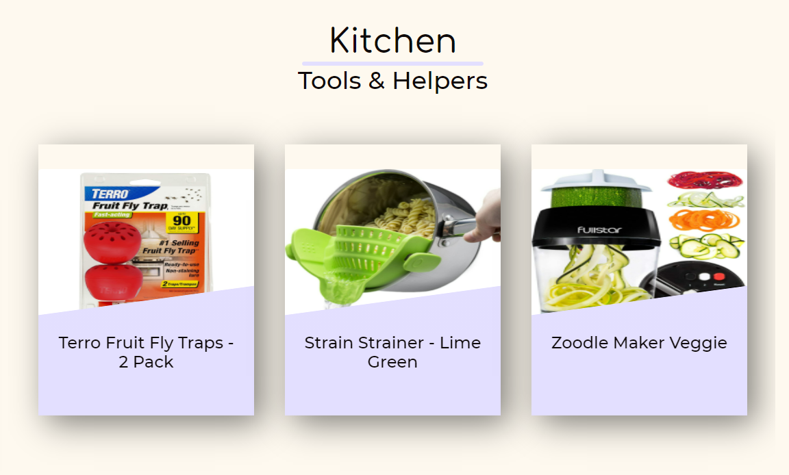

### **User Alerts** ###
- Coloured Flask flash messages and other alerts are used to feedback a range of different user actions:

  - **Success**
  
  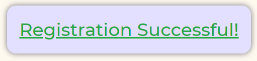
  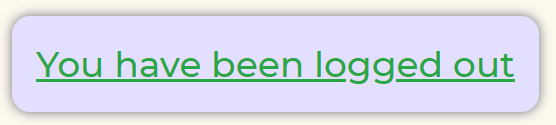
  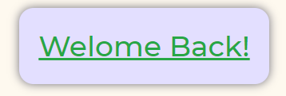  
  
  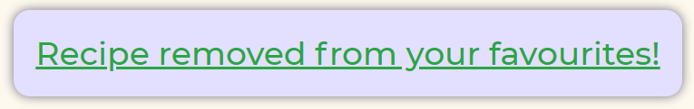
  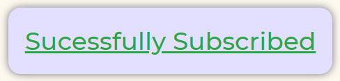
  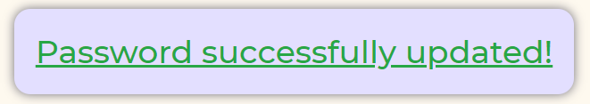
  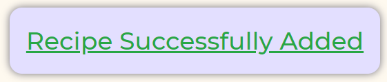
  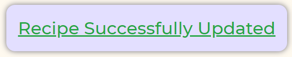
  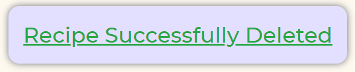

  - **Advisory & Warning**

  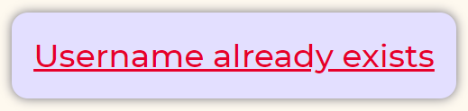
  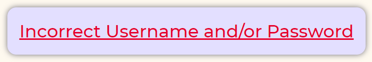
  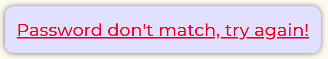
  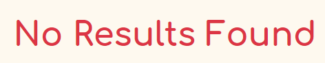
  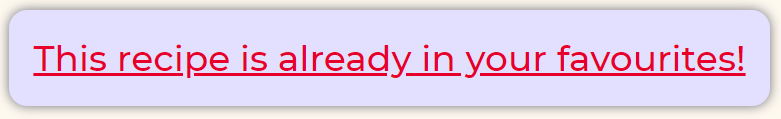
  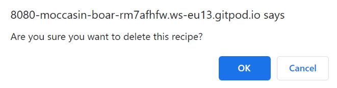  
  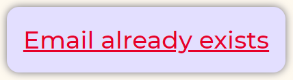
  
### **Additional Site features** ###
- A set of friendly HTTP Error landing pages for site visitors to see if a requested page is unavailable or cannot be accessed.
- The pages provide a message to the user and a button to click to return the user to the home page.

    - HTTP 404 Error

    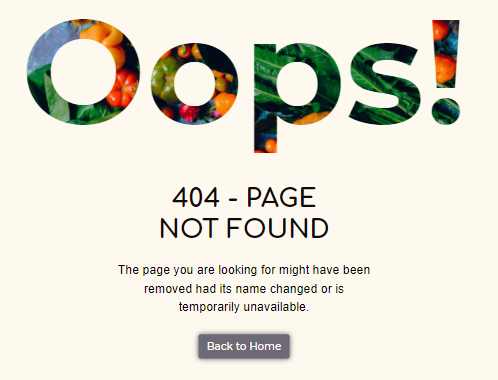
        
    - HTTP 500 Error

    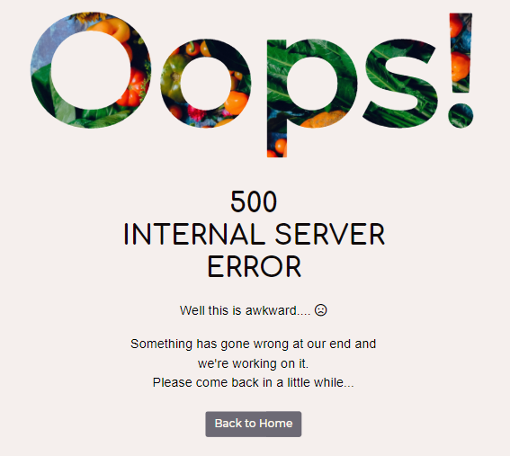

    - HTTP 503 Error

    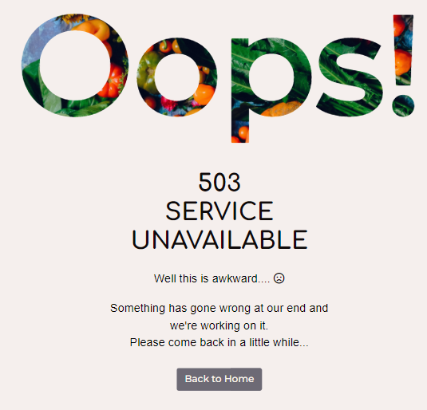

### **Future Features** ###
Site Features:
- More recipe details
- Recipe rating
- Ability to click on other user profiles and see recipes they posted
- Nutrition calculations
- User comments section on the recipes
- Blog
- Vlog
- Option to change languages


Owner / Admin Account administration such as:
- User account deactivation
- Email service for the user by forgotten password
- Weekly automated emails for subscribers

Allowing users to:
- Edit/Delete user profile
- Adding thumbnail image, avatar, user images etc.
- Upload image files as an alternative to a URL at Add Recipe Form  
- User set back password by forgotten password with email service


[Back to Table of contents](#table-of-contents)


Testing 
======

### **TESTIN.md** ###
Testing information can be found in a separate [TESTING.md](Documentation/TESTING.md).

Bugs
======

### **HTML Bugs [W3C Markup Validation](https://validator.w3.org/):** ###

- all_recipe.html
```
typo
<i> element instead of <li> element

bug fixed:
corrected the typo
```

- view_recipe.html
```
bad value for attribute on  element
width="100%"

bug fixed:
removed bad attribute + value
```

- add_recipe.html and edit_recipe.html
```
missing value attribute in <option> element

<textarea> element with not allowed type attribute

bug fixed:
added the missign value attribute to the <option> element

removed the type attribute from <textarea> element
```

### **Mentor Session** ###
**Style Changes**
- Navbar Item more spacing
- Title more spacing
- Reducing shadow styling .link
- Gallery Image Card reduce scale transform
- Product Back Cards
  - remove the stylish line 
  - no shadow style for button
- Default background colour for Favourite Button

**HTML File Changes**
- Recipe default image for recipes.html and view_recipe.html
- Add query message for search result for recipes.html and view_recipe.html
- add query message to search result

**Back End Changes**
- optimizing random Products funtion
- change-password in seperate function
- add query to html
- add abort
- add vriable ADMIN_USER_NAME = "admin"
- Profile
  - optimized profile def
  - bug fix favourite recipes + remove button
  - bug fix Admin edit functionality for all recipes 
- Recipe
  - add try: get single recipe exept: redirect to 404 error 
- Edit Recipe
  - bug fix Admin edit functionality for all recipes
  - add try: get single recipe exept: redirect to 404 error
- optimized delete functionality
- favourite functionality
  - optimized function
  - bug fix favourite show, add, remove functionality
- remove favourite functionality
  - bug fix remove functionality

[Back to Table of contents](#table-of-contents)


Deployment
======

The website was developed using *Gitpod* and using *Git* pushed to *GitHub*, which hosts the repository. I made the following steps to deploy the site using *Heroku*:

### **Cloning milestone-project-3 from GitHub** ###
### Prerequisites ###
Ensure the following are installed locally on your computer:
- [Python 3.6 or higher](https://www.python.org/download/releases/3.0/)
- [PIP3](https://pypi.org/project/pip/) Python package installer
- [Git](https://git-scm.com/) Version Control

### Cloning the GitHub repository ###
- Navigate to **Puksrevolution/milestone-project-3**
- Click the **Code** button
- **Copy** the url in the dropdown box
- Using your favourite **IDE** open up your preferred terminal
- **Navigate** to your desired file location

Copy the following code and input it into your terminal to clone the milestone-project-3:

```
git clone https://github.com/Puksrevolution/milestone-project-3.git
```

### Creation of a Python Virtual Environment ###
*Note: The process may be different depending upon your own OS - please follow this [Python help guide](https://python.readthedocs.io/en/latest/library/venv.html)
to understand how to create a virtual environment*

### Install the App dependencies and external libraries ###
- In your IDE terminal window, install the dependencies from the requirements.txt file with the following command:

```
pip3 install -r requirements.txt
```

### Create the database in MongoDB ###
*Please ensure you have an account created at [MongoDB](https://account.mongodb.com/) in order to build the database*

- In your MongoDB cluster, create a new database called `cook_book`
- Create the following collections within the new database:
  - [newsletter](Documentation/database/newsletter.json)
  - [products](Documentation/database/products.json)
  - [recipes](Documentation/database/recipes.json)
  - [users](Documentation/database/users.json)  

### Create `env.py` file ###
- The `env.py` file should contain at least the following information:

```
import os

os.environ.setdefault("IP", "0.0.0.0")
os.environ.setdefault("PORT", "5000")
os.environ.setdefault("SECRET_KEY", "YOUR_OWN_SECRET_KEY")
os.environ.setdefault("MONGO_URI", "YOUR_OWN_MONGODB_URI")
os.environ.setdefault("MONGO_DBNAME", "YOUR_OWN_MONGODB_DATABASE_NAME")
```

- Please ensure you add in your own `SECRET_KEY`, `MONGO_URI` and `MONGO_DBNAME` values.
- ***Important:*** Add the `env.py` file to your `.gitignore` file before pushing your files to any public git repository.

### Run the application ###
- To run the application enter the following command into the terminal window:

```
python3 app.py
```

### **Deploying milestone-project-3 app to Heroku** ###
### Create the Heroku App ###
*Please ensure you have an account created at [Heroku](https://signup.heroku.com/login) in order to deploy the app*

- Log in to your Heroku account dashboard and create a new app.
- Enter the App name. 
  - This needs to be unique and ... is already in use so choose a suitable alternative name for your own App.
- Choose a geographical region closest to where you live.
  - Options available on a free account are ***United States*** or ***Europe***


### Push your repository to GitHub ###
- Commit and push your local repository to your GitHub linked repsitory
- Ensure your local git repository has the following files in the root directory:

  - Heroku `Procfile`
  - `requirements.txt`

- If these are not showing in your local Git repository for any reason, enter the following commands in the terminal window:

```
echo web: python app.py > Procfile
pip3 freeze --local > requirements.txt
```
- Stage, commit and push your local Git repository to GitHub

### Connect Heroku to GitHub ###
- In the Heroku App Settings page, open the section Config Vars
- Add all the environmant variables from your local `env.py` file into the Heroku Config Vars:

| Key | Value |
| --- | --- |
| IP | 0.0.0.0 |
| PORT | 5000 |
| SECRET_KEY | YOUR_OWN_SECRET_KEY |
| MONGO_URI | YOUR_OWN_MONGODB_URI |
| MONGO_DBNAME | YOUR_OWN_MONGODB_DATABASE_NAME |

- In the Heroku App Deploy page: 
  - Select GitHub from the Deployment Method options.
  - Select Connect to GitHub.
  - Log in to your GitHub account from Heroku to link the App to GitHub.
  - Search for and select the repository to be linked in Github.
  - Select Connect.
  - Select Enable Automatic Deployment from the GitHub Master / Main branch

### Launch the App ###
- Click Open App in Heroku to launch the App in a new browser window.

[Back to Table of contents](#table-of-contents)


Credits
======

### **Images** ###
You can find the images used for the site [here](static/images). I have sourced them through various websites, which are either free to use or used under license:

- Recipe Images
  - The image URLs for the Recipe Images are sourced from the [All Recipes](https://www.allrecipes.com/) web page and used purely for educational purposes only to demonstrate the app backend CRUD functionality.
- Article Images
  - The image URLs for the Article Images are sourced from  the [Simply Recipes](https://www.simplyrecipes.com/) web page and used purely for educational purposes only.
- Product Images
  - The image URLs for the Prouduct Images are sourced from the [Amazon](https://www.amazon.com/) web page and used purely for educational purposes only.
- Error Image
  - The [Error Pages Text Background Image](static/images/pexels-ella-olsson-1458694.jpg) was sourced from [Pexels](https://www.pexels.com/) web page and used purely for educational purposes only.

### **Content** ###
- Recipe Content
  - The content for the Recipes was sourced from the [All Recipes](https://www.allrecipes.com/) web page and used purely for educational purposes only to demonstrate the app backend CRUD functionality.
- Further Recipe Content
  - Further content for recipes will be provided by users
- Article Content
  - The content for the Article was sourced from the [Simply Recipes](https://www.simplyrecipes.com/) web page and used purely for educational purposes only.
- Contact, About Us, Advertise and Terms Of Use Content
  - The content for the Contact, About Us, Advertise and Terms Of Use was sourced from the [Simply Recipes](https://www.simplyrecipes.com/) web page and used purely for educational purposes only.
- Accessibility and Privacy Policy Content
  - The content for the Accessibility and Privacy Policy was sourced from the [Chrysalis Coding](http://chrysalis-coding.herokuapp.com/), get customized to match the needs of the app application and used purely for educational purposes only.
- Product Content
  - The content for the Prouducts was sourced from the [Amazon](https://www.amazon.com/) web page and used purely for educational purposes only.
- Error content
  - The content for the Error Pages was sourced from the GitHub repository of [Simon Vardy](https://github.com/simonjvardy/the-reading-room/tree/master/templates/error-handling) and used purely for educational purposes only.
- README.md
  - Some of the content and structure was sourced from the GitHub repository of [Simon Vardy](https://github.com/simonjvardy/the-reading-room/tree/master/templates/error-handling), customized and used purely for educational purposes only.

### **Code** ###

All the Code Snippets I have sourced through various websites was adapedet and customized to macht the project needs and functionality.

**[Code Institute](https://www.codeinstitute.net/)**
- [Course Material Task Manager Flask App mini Project](https://github.com/Code-Institute-Solutions/TaskManagerAuth)
  - HTML:
    - Navbar
    - Form
  - Python:
    - Configuration
    - User account management
    - CRUD Functionality    


**[Bootstrap](https://getbootstrap.com/)**
- HTML:
  - Gallery Cards
  - Add / Edit Form
  - Article / Recipe Page

**[Stack Overflow](https://stackoverflow.com/)**

**Automatically update the Copyright Year**
```
JavaScript:

document.getElementById("current-year").innerHTML = new Date().getFullYear();

HTML:

<span id="current-year"></span>
```

**CSS Flash Messages**
```
HTML:


  
    <div class="{{ category }}">{{ message }}</div>
  


CSS:

.error {
    color: red
}

Python:

flash("This is an example text!", "error")

```

**Changing the active class of a link with css in python/flask**
```
JavaScript:

$(document).ready(function () {
    var scriptElement = $('#baseScript')[0];
    var path = scriptElement.getAttribute('data-path');
    $('a[href="'+path+'"]').addClass("active");
});

HTML:

<script id="baseScript" src="{{ url_for('static', filename='js/base.js') }}"
data-path="{{ request.path }}"></script>
```

**Hover over text**
```
HTML:

<a href="#" class="tip">Link<span>This is the CSS tooltip showing up when you mouse over the link</span></a>


CSS:

a.tip {
    border-bottom: 1px dashed;
    text-decoration: none
}
a.tip:hover {
    cursor: help;
    position: relative
}
a.tip span {
    display: none
}
a.tip:hover span {
    border: #c0c0c0 1px dotted;
    padding: 5px 20px 5px 5px;
    display: block;
    z-index: 100;
    background: url(../images/status-info.png) #f0f0f0 no-repeat 100% 5%;
    left: 0px;
    margin: 10px;
    width: 250px;
    position: absolute;
    top: 10px;
    text-decoration: none
}
```

**How to use the onerror attribute for an img element**
```

```

**[Udemy](https://www.udemy.com/)**
- [Jannis Seemann (CodingCourses.TV)](https://www.udemy.com/user/jannis-seemann-3/?src=sac&kw=Jannis+Seemann)
  - CSS Code Snippet from Fortgeschrittenes CSS for:
    - the Product Cards Section
    - the Sign Up and Sign In Form

**[GitHub](https://github.com/)**
- [paulvmking](https://github.com/paulvmking/y)
  - [Pagination](https://github.com/paulvmking/Pal-lette/blob/master/app.py)
  - [Favourite functionality](https://github.com/paulvmking/Pal-lette/blob/master/app.py)
- [simonjvardy](https://github.com/simonjvardy/)
  - Some of the notes for the app.py
  - [Error Pages HTML](https://github.com/simonjvardy/the-reading-room/tree/master/templates/error-handling)
  - [Error Pages CSS](https://github.com/simonjvardy/the-reading-room/blob/master/static/css/error.css)
- [andreasdk](https://github.com/andreasdk)
  - [Random Recipes and Products functionality](https://github.com/andreasdk/dcd-recipes/blob/master/whisk/main/routes.py)
- [sabinemm](https://github.com/sabinemm/)
  - [Newsletter functionality](https://github.com/sabinemm/recipe-site-ms3/blob/master/app.py)
- [StoneMasons4106](https://github.com/StoneMasons4106/)
  - [Change Password functionality](https://github.com/StoneMasons4106/connect-recipes/blob/master/app.py)

### **Acknowledgements** ###
- [Simon Vardy](https://github.com/simonjvardy/) for project inspiration and README.md format ideas.
- [Paul King](https://github.com/paulvmking/) for project inspiration, web page content ideas, support and help..
- [Code Institute](https://codeinstitute.net/full-stack-software-development-diploma/) Course material for the inspiration from code-along challenges, specifically the Task Manager and Thorin Flask apps.
- [Stack Overflow](https://stackoverflow.com/) For help fixing so many thing that fell over on this project!

[Back to Table of contents](#table-of-contents)